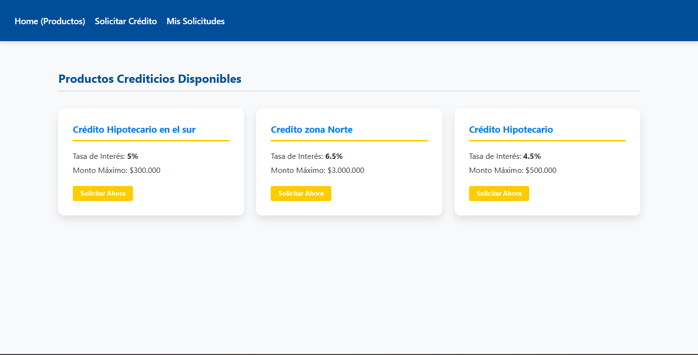
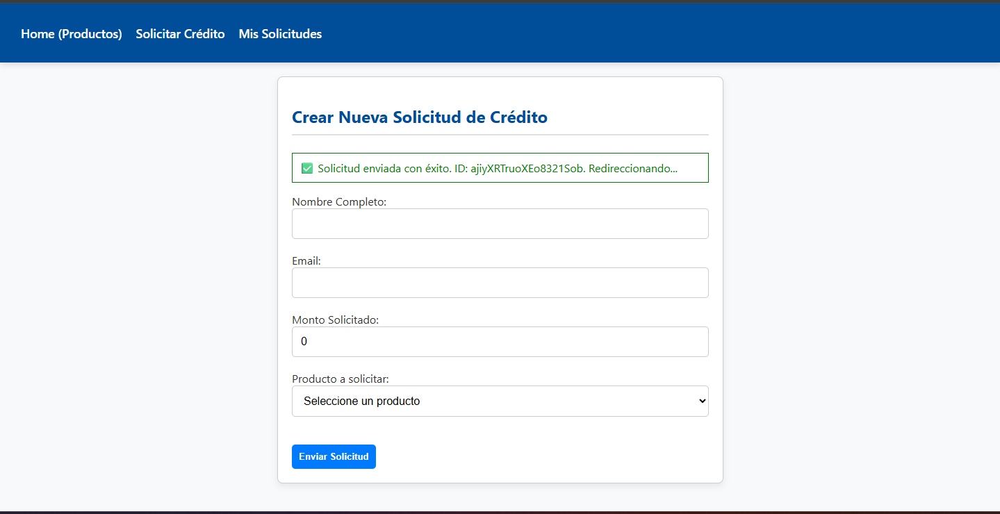

#  EA3: Integración con Backend (Firebase) - CreditSmart

**Autor:** Jhon Jairo Rivera

Este proyecto es una aplicación web desarrollada con **React y Vite** que simula la gestión de productos crediticios. Su objetivo principal es demostrar la integración completa de servicios **Backend como Servicio (BaaS)** usando **Google Firebase (Firestore)**.

El proyecto implementa la lógica necesaria para manejar operaciones de lectura, creación y consulta de datos en tiempo real.

---

##  Funcionalidades Demostradas (CRUD)

La aplicación cubre los siguientes criterios funcionales del backend:

| Operación | Ruta | Descripción |
| :--- | :--- | :--- |
| **READ** (Lectura) | `/` (Home) | Carga y muestra una lista de productos crediticios disponibles desde la colección `productos_crediticios` de Firestore. |
| **CREATE** (Creación) | `/solicitar-credito` | Permite a los usuarios enviar una solicitud de crédito, validando los campos y guardando un nuevo documento en la colección `solicitudes_credito`. |
| **QUERY** (Consulta/Filtro) | `/mis-solicitudes` | Filtra las solicitudes de crédito basándose en un email de prueba (`test@user.com`) y las ordena por fecha de creación (descendente). |

---

##  Vistas de la Aplicación

A continuación, se muestran capturas de las pantallas principales del proyecto:

### 1. Vista de Productos (Home)

Muestra los productos disponibles, leídos directamente desde Firestore.



### 2. Formulario de Solicitud (CREATE)

Página para ingresar los datos de la nueva solicitud de crédito.



### 3. Mis Solicitudes (QUERY)

Muestra la tabla de resultados de las solicitudes, filtradas para un usuario específico (ej: test@user.com).


---

##  Tecnologías y Requisitos

* **Frontend:** React v18, Vite
* **Routing:** React Router DOM v6
* **Backend:** Google Firebase
    * **Base de Datos:** Cloud Firestore

### Requisitos de Configuración

Para que la funcionalidad QUERY (`/mis-solicitudes`) funcione correctamente, debes haber creado el siguiente **Índice Compuesto** en la Consola de Firestore:

* **Colección:** `solicitudes_credito`
* **Campo 1:** `email` (Ascendente)
* **Campo 2:** `fechaSolicitud` (Descendente)

### Instalación Local

1.  **Clonar el Repositorio:**
    ```bash
    git clone [https://github.com/jjrm23/-EA3-Integraci-n-con-Backend-Firebase---CreditSmart.git](https://github.com/jjrm23/-EA3-Integraci-n-con-Backend-Firebase---CreditSmart.git)
    cd -EA3-Integraci-n-con-Backend-Firebase---CreditSmart
    ```

2.  **Instalar Dependencias:**
    ```bash
    npm install
    ```

3.  **Configurar Variables de Entorno:**
    Crea un archivo `.env` en la raíz del proyecto con tus credenciales de Firebase.

4.  **Iniciar la Aplicación:**
    ```bash
    npm run dev
    ```
    La aplicación se ejecutará en `http://localhost:5173/`.